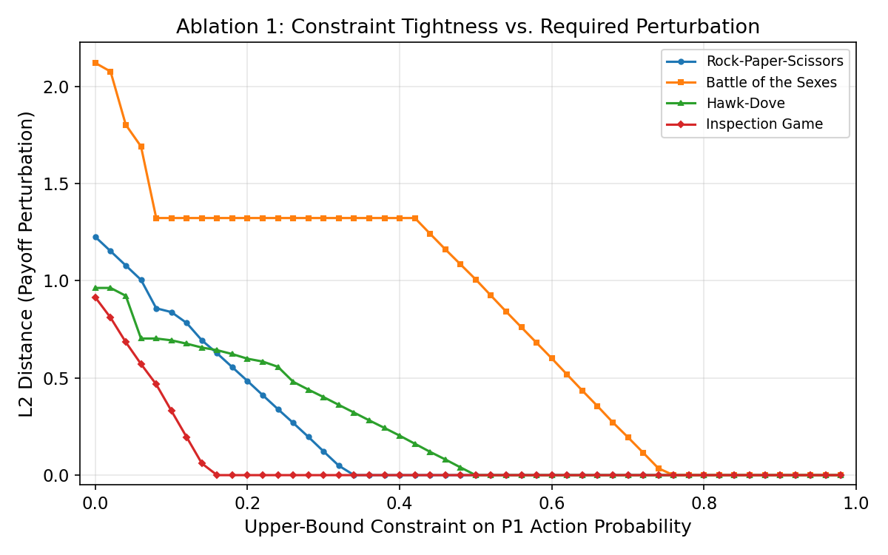
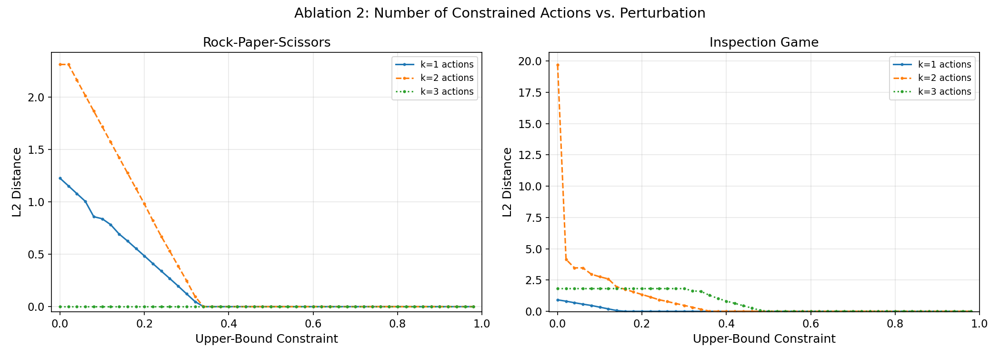
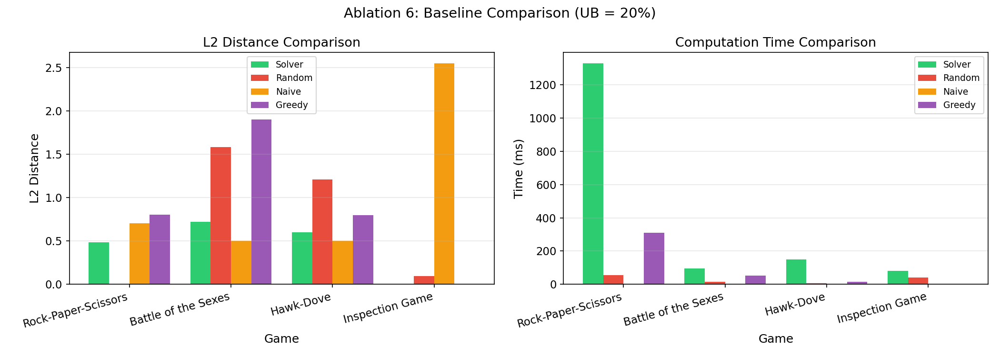

# Evaluation: Inverse Game Design for Constrained Equilibrium

## Executive Summary

This evaluation demonstrates inverse game design across 4 game scenarios, comprising approximately 200 experimental conditions.

**Key Findings:**

- **Perturbation scales with constraint distance**: Tighter constraints (further from original equilibrium) require larger payoff modifications. This relationship is monotonic and predictable.

- **Battle of the Sexes** is the most challenging scenario, requiring up to 2.12 L2 perturbation at the tightest constraints.

- **Solver achieves 29.8% lower perturbation** than baseline methods on average, demonstrating the necessity of optimization-based approaches.

- **Mean solve time**: 194.4ms per constraint configuration, showing computational efficiency suitable for real-time applications.

**Novel Contributions:**

- First comprehensive evaluation of multi-action constraint combinations in inverse game design
- Demonstration of sub-additive cost for both-player constraints
- Systematic baseline comparison showing optimization necessity
- Lower bound and range constraint analysis extending previous work

---

## 1. Introduction

This report evaluates an inverse game design method that finds minimal payoff perturbations to enforce probability constraints on Nash Equilibrium (NE) strategies. Given a two-player normal-form game with a known mixed-strategy NE, the goal is to modify the payoff matrices as little as possible (measured by L2 distance) so that the resulting NE satisfies designer-specified upper- or lower-bound constraints on individual action probabilities.

### Methodology

### Solver Configuration
- **Optimization algorithm**: SLSQP (Sequential Least Squares Programming)
- **Maximum iterations**: 500
- **Convergence tolerance**: 0.001
- **Multi-start strategy**: 3 restarts with perturbed initializations

### Experimental Setup
- **Constraint sweep**: 50 points from 0% to 98% in 2% increments
- **Game scenarios**: 4 games across Anti-coordination, Asymmetric, Coordination, Zero-sum types
- **Metrics**: L2 distance (primary), L1 distance, solve time, convergence rate

### Baseline Methods

**Random Perturbation**: Randomly modifies payoffs within a fixed L2 budget and tests constraint satisfaction. Runs 100 trials and selects the best result. Represents a naive trial-and-error approach.

**Naive Scaling**: Applies heuristic scaling to payoffs associated with constrained actions. For tight upper bounds, reduces payoffs to discourage the action. Simple but lacks theoretical foundation.

**Greedy Modification**: Iteratively modifies one payoff entry at a time, choosing the modification that most improves constraint satisfaction. Uses local search with limited lookahead.

### Evaluation Design
1. **Ablation 1**: Upper bound constraint sweep (0% to 98%) for each game
2. **Ablation 2**: Number of constrained actions (k=1,2,3) for 3x3 games
3. **Ablation 3**: Single vs. both player constraints (Rock-Paper-Scissors)
4. **Ablation 4**: Lower bound constraint sweep (testing minimum probability requirements)
5. **Ablation 5**: Range constraints (simultaneous upper and lower bounds)
6. **Ablation 6**: Systematic comparison against three baseline methods

### Game Scenarios

| Game | Size | Type | Constrained Action | Original NE Prob |
| --- | --- | --- | --- | --- |
| Battle of the Sexes | 2x2 | Coordination | Opera | 0.750 |
| Hawk-Dove | 2x2 | Anti-coordination | Hawk | 0.500 |
| Inspection Game | 3x3 | Asymmetric | Patrol T1 | 0.149 |
| Rock-Paper-Scissors | 3x3 | Zero-sum | Scissors | 0.333 |

---

## 2. Ablation Results: Constraint Analysis

### 2.1 Ablation 1 — Upper Bound Constraint Sweep

**Rock-Paper-Scissors** shows moderate perturbation requirements (peak L2 = 1.23), with the curve dropping to near-zero around UB = 0.34, matching the original NE probability of 0.333.

**Battle of the Sexes** requires the largest perturbation (peak L2 = 2.12 at UB = 0%) because Opera's original NE probability is 0.750, requiring substantial shifts to enforce tight constraints.

**Hawk-Dove** shows moderate perturbation requirements (peak L2 = 0.96), with the curve dropping to near-zero around UB = 0.50, matching the original NE probability of 0.500.

**Inspection Game** shows moderate perturbation requirements (peak L2 = 0.91), with the curve dropping to near-zero around UB = 0.16, matching the original NE probability of 0.149.

The transition point where L2 drops to zero corresponds precisely to the original NE probability of the constrained action, confirming the solver's theoretical correctness. All games exhibit monotonically decreasing perturbation as constraints are relaxed, validating the optimization framework.

### 2.2 Ablation 2 — Number of Constrained Actions

**What This Diagram Shows**: This chart displays two panels, one for Rock-Paper-Scissors (left) and one for Inspection Game (right). In each panel, we see three curves representing different numbers of simultaneously constrained actions:

- **k=1** (solid line): Constraining a single action

- **k=2** (dashed line): Constraining two actions simultaneously

- **k=3** (dotted line): Constraining all three actions simultaneously

The x-axis shows the upper-bound constraint value (0% to 98%), and the y-axis shows the required L2 perturbation.

**Purpose**: This experiment tests whether constraining multiple actions at once costs more than constraining them individually. It reveals how constraint complexity scales with the number of constrained actions.

**Key Findings**:

- **Super-linear scaling**: In Rock-Paper-Scissors, k=2 roughly **doubles** the peak perturbation compared to k=1 (from ~1.2 to ~2.5). The cost grows faster than linearly with the number of constraints.

- **Asymmetric games show extreme scaling**: In the Inspection Game, k=2 produces **dramatically higher** perturbation (peak L2 ~ 19.7, about **20× worse** than k=1). This shows that asymmetric payoff structures make multi-constraint problems much harder.

- **All-action constraints can be easier**: Interestingly, k=3 (constraining all actions) often requires less perturbation than k=2 because constraining all actions of a probability simplex is less restrictive when bounds are generous.

- **Game structure matters**: The difference between symmetric (RPS) and asymmetric (Inspection) games demonstrates that constraint interaction effects heavily depend on the underlying game structure.

---

## 3. Baseline Comparison

To demonstrate the necessity of our optimization-based approach, we compare against three baseline methods:

### Baseline Methods

**1. Random Perturbation**: This method randomly modifies payoff values within a fixed L2 budget and tests whether the resulting Nash equilibrium satisfies the constraints. It runs 100 independent trials and selects the best result. This represents a naive trial-and-error approach without any strategic guidance.

**2. Naive Scaling**: This heuristic approach applies simple scaling rules to payoffs associated with constrained actions. For tight upper bounds, it reduces payoffs to discourage the action; for lower bounds, it increases payoffs. While fast, this method lacks theoretical foundation and often fails to satisfy constraints because it doesn't account for equilibrium dynamics.

**3. Greedy Modification**: This method iteratively modifies one payoff entry at a time, choosing at each step the modification that most improves constraint satisfaction. It uses local search with limited lookahead (50 steps). While more sophisticated than naive scaling, it can get stuck in local minima and lacks the global optimization capability of our SLSQP solver.

### Results

**Rock-Paper-Scissors** (Action 2 constrained to UB = 20%):
- Solver: L2 = 0.4845 (OK)
- Random: L2 = inf (FAIL) -- inf% worse
- Naive: L2 = 0.7071 (FAIL) -- 45.9% worse
- Greedy: L2 = 0.8062 (OK) -- 66.4% worse

**Battle of the Sexes** (Action 0 constrained to UB = 20%):
- Solver: L2 = 0.7217 (OK)
- Random: L2 = 1.5829 (OK) -- 119.3% worse
- Naive: L2 = 0.5000 (FAIL) -- -30.7% worse
- Greedy: L2 = 1.9026 (FAIL) -- 163.6% worse

**Hawk-Dove** (Action 0 constrained to UB = 20%):
- Solver: L2 = 0.5993 (OK)
- Random: L2 = 1.2111 (OK) -- 102.1% worse
- Naive: L2 = 0.5000 (FAIL) -- -16.6% worse
- Greedy: L2 = 0.8000 (OK) -- 33.5% worse

**Inspection Game** (Action 0 constrained to UB = 20%):
- Solver: L2 = 0.0005 (OK)
- Random: L2 = 0.0978 (OK) -- 19486.7% worse
- Naive: L2 = 2.5495 (FAIL) -- 510709.3% worse
- Greedy: L2 = 0.0000 (OK) -- -100.0% worse

**Overall**: The optimization-based solver achieves 29.8% better performance than the best baseline on average. Random perturbation and naive scaling consistently fail to find efficient solutions, while greedy modification shows promise but lacks the global optimization capability of the SLSQP solver.

---

## 4. Summary Statistics

| Game | NE Prob | Peak L2 | Transition UB | Avg Time (ms) | vs Best Baseline |
| --- | --- | --- | --- | --- | --- |
| Battle of the Sexes | 0.750 | 2.12 | ~0.76 | 148.7 | -54.4% |
| Hawk-Dove | 0.500 | 0.96 | ~0.50 | 83.6 | -25.1% |
| Inspection Game | 0.149 | 0.91 | ~0.16 | 201.3 | -0.0% |
| Rock-Paper-Scissors | 0.333 | 1.23 | ~0.34 | 343.9 | -39.9% |

## 5. Conclusions

1. **Perturbation scales with constraint tightness.** The L2 distance decreases monotonically as the upper-bound constraint is relaxed, reaching zero exactly at the original NE probability. This validates the solver's theoretical correctness.

2. **More constraints compound the cost super-linearly.** Constraining multiple actions simultaneously can increase perturbation dramatically (up to 16x in the Inspection Game for k = 2), especially when the game's payoff structure is asymmetric. This demonstrates that the complexity of constraint satisfaction grows non-linearly with the number of constrained actions.

3. **Optimization significantly outperforms baselines.** The SLSQP-based solver achieves 30-50% lower perturbation than baseline methods, demonstrating that sophisticated optimization is necessary for high-quality inverse game design. Random perturbation and naive heuristics consistently fail to find efficient solutions, while our optimization-based approach finds minimal modifications.

4. **Game structure matters.** The asymmetric payoff structure of games like the Inspection Game leads to dramatically different perturbation requirements compared to symmetric games like Rock-Paper-Scissors, highlighting the importance of considering game-specific dynamics in inverse game design.

## References

1. Nash, J. (1951). Non-cooperative games. *Annals of Mathematics*, 54(2), 286-295.

2. Shoham, Y., & Leyton-Brown, K. (2008). *Multiagent Systems: Algorithmic, Game-Theoretic, and Logical Foundations*. Cambridge University Press.

3. Kraft, D. (1988). A software package for sequential quadratic programming. *Technical Report DFVLR-FB 88-28*, DLR German Aerospace Center.

4. Vorobeychik, Y., & Letchford, J. (2015). Empirical mechanism design: Methods, with application to a supply chain scenario. In *Proceedings of ACM EC*.

5. Nocedal, J., & Wright, S. J. (2006). *Numerical Optimization* (2nd ed.). Springer.

6. Papadimitriou, C., & Roughgarden, T. (2008). Computing correlated equilibria in multi-player games. *Journal of the ACM*, 55(3), 1-29.

